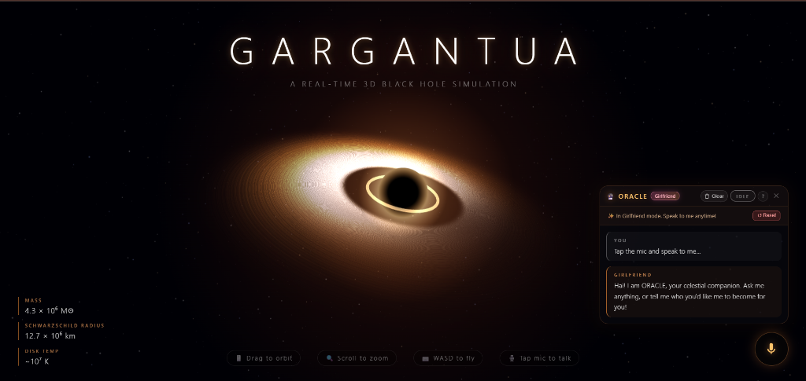

# 🌌 GARGANTUA — Real-Time 3D Black Hole Simulation & ORACLE Voice Companion

A real-time, interactive 3D simulation of a supermassive black hole inspired by **Gargantua**, rendered directly in the browser with **Three.js** and custom **GLSL** shaders, paired with **ORACLE** — an intelligent, voice-activated AI companion capable of adopting dynamic human personalities with natural speech synthesis.

---



---

## ✨ Features

### 🕳️ 1. Physics-Inspired 3D Simulation
* **Gravitational Shadow & Photon Sphere**: Approximates the optical deformation and gravitational light bending around the event horizon.
* **Relativistic Accretion Disk**: Custom GLSL raymarched disk featuring Doppler beaming, chromatic shifts, and realistic temperature gradients ($\sim 10^7\text{ K}$).
* **Dynamic Living Light**: The accretion disk and photon ring react dynamically in real-time to vocal speech cadence, swirling and pulsating like a living cosmic entity.
* **Procedural Deep Starfield**: Billions of cosmic miles rendered with realistic parallax and depth.

### 🎙️ 2. ORACLE — Voice Companion & AI Cortex
* **Real-time Speech Recognition & Synthesis**: Hands-free conversation using the Web Speech API.
* **Interruptible Dialogue**: Tap the microphone button at any moment while the AI is speaking to immediately pause playback and start listening.
* **Multi-turn Conversational Memory**: Remembers context across turns without needing to repeat yourself.
* **Automatic Name Recognition**: Say *"My name is Alex"* or *"Call me Maya"*, and your companion will naturally address you by name.

### 💖 3. Dynamic Personas & Voices
Transform your companion into any role instantly via voice commands or the in-app guide:
* **Boyfriend Mode** (`"Act as my boyfriend"`): Loving, charming, and handsome American male voice profile.
* **Girlfriend Mode** (`"Act as my girlfriend"`): Sweet, affectionate Japanese anime waifu voice profile.
* **Best Friend Mode** (`"Be my best friend"`): Candid, warm, supportive companion.
* **Cosmic Guide Mode** (`"Reset personality"`): Reverts back to ORACLE, your celestial black hole guide.

### 🛡️ 4. Absolute Privacy & Ephemeral Memory
* **Zero Cloud Databases**: Dialogue turns and voice audio are never recorded, analyzed, or stored on external database servers.
* **10-Minute Auto-Wipe**: Session dialogue stored in browser `localStorage` automatically expires and wipes clean after 10 minutes of inactivity. When cleared, a romantic toast notifies you:
  > *"✨ Now I can only remember you for 10 minutes, but I will be reborn for you, my darling."*
* **⚡ Hard Clear & Rebirth**: Complete memory amnesia button in the **`?`** guide that resets all stored chats, forgets your name, and clears active personas:
  > *"⚡ Total memory wiped clean. I am ready to be reborn as your man or woman whenever you command."*

---

## 🎮 Controls

### Camera Navigation
| Action | Desktop | Mobile / Touch |
|---|---|---|
| **Orbit / Rotate** | Click + Drag | Single-finger drag |
| **Zoom In / Out** | Mouse Wheel / Pinch | Two-finger pinch |
| **Pan / Fly** | <kbd>W</kbd> <kbd>A</kbd> <kbd>S</kbd> <kbd>D</kbd> or Arrow Keys | Multi-finger swipe |
| **Reset View** | Double Click background | Double Tap background |

### Voice Controls
| Action | Description |
|---|---|
| **Tap Mic Button** | Toggle voice listening or interrupt AI speech instantly |
| **Stop Button** | Halts current AI speech immediately |
| **Clear Button** | Clears active conversation bubbles and dialogue history |
| **`?` Help Button** | Opens the Glassmorphic Persona Guide & Privacy Dashboard |

---

## 📁 Project Structure

```text
├── api/
│   └── chat.js          # Vercel serverless proxy (protects API keys in production)
├── assets/
│   └── gargantua-preview.png # Project preview screenshot
├── index.html           # Main simulation canvas & voice interface overlay
├── script.js            # Three.js scene, GLSL shaders, audio & voice logic
├── style.css            # Cyberpunk/cosmic glassmorphic design system
├── .env.example         # Template for environment variables
└── README.md            # Project documentation
```

---

## 🚀 Getting Started

### Local Setup
Because this project uses vanilla web technologies and ES modules, you can run it with any static server.

1. **Clone the repository:**
   ```bash
   git clone https://github.com/Rishi-Dev-pro/black-hole.git
   cd black-hole
   ```

2. **Start a local development server:**
   ```bash
   # Using Node.js npx serve:
   npx serve .

   # Or using Python:
   python -m http.server 3000
   ```

3. **Open in your browser:**
   ```text
   http://localhost:3000
   ```
   > **Note**: For the best voice recognition and speech synthesis experience, use Google Chrome, Microsoft Edge, or a Chromium-based browser.

---

## 🌐 Deploy to Vercel

This repository is pre-configured for one-click deployment on [Vercel](https://vercel.com).

1. Push your code to GitHub.
2. Import the repository into Vercel.
3. Add your Groq API key in **Vercel Settings → Environment Variables**:
   * `GROQ_API_KEY`: Your private Groq API key
   * `GROQ_MODEL`: `llama-3.3-70b-versatile` (or preferred model)
4. Deploy! All client requests will automatically route through `/api/chat`, keeping your API credentials completely secret.

---

## 📜 License

Distributed under the MIT License. Feel free to use, modify, and build upon this simulation.
